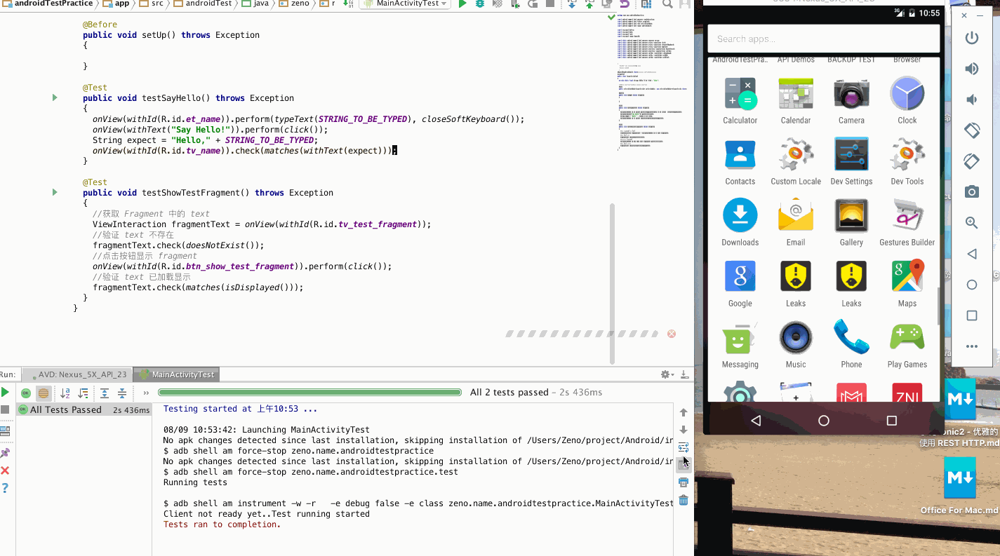

# androidTestPractice - [github](https://github.com/puppet2436/androidTestPractice)
Android Unit Test Practice




在这个codelab中，你将学习如何在Android Studio中配置工程用于测试，在开发机器上编写并运行单元测试，以及如何在手机上做功能UI测试。

#### 你会学到什么

- 更新包含JUnit和Android Testing Support Library的Gradle构建文件
- 编写运行在本机Java虚拟机上的单元测试
- 编写运行在手机或者虚拟机上的Espresso测试

#### 你需要什么

- Android Studio v1.2+
- Android 4.0+的测试设备

## 1. 创建新的 Android Studio 工程

## 2. 配置支持单元测试的工程

打开工程的build.gradle（Module:app）文件，添加JUnit4依赖，点击Gradle sync按钮。

build.gradle

```groovy
dependencies {
  compile fileTree(dir: 'libs', include: ['*.jar'])
  testCompile 'junit:junit:4.12'
  compile 'com.android.support:appcompat-v7:24.1.1'
}
```

当你同步Gradle配置时，可能需要联网下载JUnit依赖。

## 创建第一个单元测试

创建一个非常简单的被测类：Calculator类。向类中添加一些基本的算术运算方法，比如加法和减法。将下列代码复制到编辑器中。不用担心实际的实现，暂时让所有的方法返回0。

```java
public class Calculator
{
  public double sum(double a, double b)
  {
    return 0;
  }

  public double substract(double a, double b)
  {
    return 0;
  }

  public double divide(double a, double b)
  {
    return 0;
  }

  public double multiply(double a, double b)
  {
    return 0;
  }
}
```

在编辑器内右键点击Calculator类的声明，选择Go to > Test，然后"Create a new test…",或 'shift + command + T',在打开的对话窗口中，选择JUnit4和"setUp/@Before"，同时为所有的计算器运算生成测试方法。


这样，就会在正确的文件夹内(app/src/test/java/com/example/testing/testingexample)生成测试类框架，在框架内填入测试方法即可。下面是一个示例：

```java
public class CalculatorTest
{
  private Calculator mCalculator;

  @Before
  public void setUp() throws Exception
  {
    mCalculator = new Calculator();
  }

  @Test
  public void testSum() throws Exception
  {
    //expected: 6, sum of 1 and 5
    assertEquals(6d, mCalculator.sum(1d, 5d), 0);
  }

  @Test
  public void testSubstract() throws Exception
  {
    assertEquals(1d, mCalculator.substract(5d, 4d), 0);
  }

  @Test
  public void testDivide() throws Exception
  {
    assertEquals(4d, mCalculator.divide(20d, 5d), 0);
  }

  @Test
  public void testMultiply() throws Exception
  {
    assertEquals(10d, mCalculator.multiply(2d, 5d), 0);
  }
}
```

## 运行单元测试

终于到运行测试的时候了！右键点击CalculatorTest类，选择Run > CalculatorTest。也可以通过命令行运行测试，在工程目录内输入：

```bash
./gradlew test
```

无论如何运行测试，都应该看到输出显示4个测试都失败了。这是预期的结果，因为我们还没有实现运算操作。


让我们修改Calculator类中的sum(double a, double b)方法返回一个正确的结果，重新运行测试。你应该看到4个测试中的3个失败了。

```java
  public double sum(double a, double b)
  {
    return a + b;
  }
```

作为练习，你可以实现剩余的方法使所有的测试通过。

> 可能你已经注意到了Android Studio从来没有让你连接设备或者启动模拟器来运行测试。那是因为，位于src/tests目录下的测试是运行在本地电脑Java虚拟机上的单元测试。编写测试，实现功能使测试通过，然后再添加更多的测试...这种工作方式使快速迭代成为可能，我们称之为测试驱动开发。
值得注意的是，当在本地运行测试时，Gradle为你在环境变量中提供了包含Android框架的android.jar包。但是它们功能不完整（所以，打个比方，你不能单纯调用Activity的方法并指望它们生效）。推荐使用Mockito等mocking框架来mock你需要使用的任何Android方法。对于运行在设备上，并充分利用Android框架的测试，请继续阅读本篇教程的下个部分。

## 配置支持Instrumentation测试的工程

虽然在Android框架内支持运行instrumentation测试，但是目前开发重心主要集中在刚刚发布的作为Android Testing Support Library一部分的新的AndroidJUnitRunner。测试库包含Espresso，用于运行功能UI测试的框架。让我们通过编辑build.gradle的相关部分来把它们添加进我们的工程。

```groovy
apply plugin: 'com.android.application'

android {
  compileSdkVersion 24
  buildToolsVersion "23.0.3"

  defaultConfig {
    applicationId "zeno.name.androidtestpractice"
    minSdkVersion 15
    targetSdkVersion 24
    versionCode 1
    versionName "1.0"

    //ADD THIS LINE:
    testInstrumentationRunner "android.support.test.runner.AndroidJUnitRunner"
  }

  buildTypes {
    release {
      minifyEnabled false
      proguardFiles getDefaultProguardFile('proguard-android.txt'), 'proguard-rules.pro'
    }
  }

  //ADD THESE LINES:
  packagingOptions {
    exclude 'LICENSE.txt'
  }

}

dependencies {
  compile fileTree(dir: 'libs', include: ['*.jar'])

  testCompile 'junit:junit:4.12'
  //ADD THESE LINES:
  androidTestCompile 'com.android.support.test:runner:0.5'
  androidTestCompile 'com.android.support.test:rules:0.5'
  androidTestCompile 'com.android.support.test.espresso:espresso-core:2.1'

  compile 'com.android.support:appcompat-v7:24.1.1'
}
```

> **重要**：由于一些依赖版本冲突，你需要确认com.android.support:appcompat-v7库的版本号是23.1.1，像上面的代码片段一样。

## 未App添加简单的交互


在使用Espresso进行UI测试前，让我们为app添加一些Views和简单的交互。我们使用一个用户可以输入名字的EditText，欢迎用户的Button和用于输出的TextView。打开res/layout/activity_main.xml，粘贴如下代码：

```xml
<?xml version="1.0" encoding="utf-8"?>
<LinearLayout
  xmlns:android="http://schemas.android.com/apk/res/android"
  xmlns:tools="http://schemas.android.com/tools"
  android:layout_width="match_parent"
  android:layout_height="match_parent"
  android:orientation="vertical"
  android:paddingBottom="@dimen/activity_vertical_margin"
  android:paddingLeft="@dimen/activity_horizontal_margin"
  android:paddingRight="@dimen/activity_horizontal_margin"
  android:paddingTop="@dimen/activity_vertical_margin"
  tools:context="zeno.name.androidtestpractice.MainActivity"
  >

  <android.support.v7.widget.AppCompatTextView
    android:id="@+id/tv_name"
    android:layout_width="match_parent"
    android:layout_height="wrap_content"
    android:layout_marginTop="4dp"
    android:padding="4dp"
    android:text="hello"
    />

  <android.support.v7.widget.AppCompatEditText
    android:id="@+id/et_name"
    android:layout_width="match_parent"
    android:layout_height="wrap_content"
    />

  <android.support.v7.widget.AppCompatButton
    android:layout_width="match_parent"
    android:layout_height="wrap_content"
    android:onClick="sayHello"
    android:text="@string/main_say_hello"
    />
</LinearLayout>
```

还需要在MainActivity.java中添加onClick handler：

```java
package zeno.name.androidtestpractice;

import android.support.v7.app.AppCompatActivity;
import android.os.Bundle;
import android.view.View;
import android.widget.Button;
import android.widget.EditText;
import android.widget.TextView;

public class MainActivity extends AppCompatActivity
{
  private TextView tvName;
  private EditText etName;

  @Override
  protected void onCreate(Bundle savedInstanceState)
  {
    super.onCreate(savedInstanceState);
    setContentView(R.layout.activity_main);
    tvName = (TextView) findViewById(R.id.tv_name);
    etName = (EditText) findViewById(R.id.et_name);
  }

  public void sayHello(View v)
  {
    tvName.setText("Hello," + etName.getText());
  }
}
```

```java
package zeno.name.androidtestpractice;

import android.support.test.espresso.ViewInteraction;
import android.support.test.filters.LargeTest;
import android.support.test.rule.ActivityTestRule;
import android.support.test.runner.AndroidJUnit4;

import org.junit.Before;
import org.junit.Rule;
import org.junit.Test;
import org.junit.runner.RunWith;

import static android.support.test.espresso.Espresso.onView;
import static android.support.test.espresso.action.ViewActions.click;
import static android.support.test.espresso.action.ViewActions.closeSoftKeyboard;
import static android.support.test.espresso.action.ViewActions.typeText;
import static android.support.test.espresso.assertion.ViewAssertions.doesNotExist;
import static android.support.test.espresso.assertion.ViewAssertions.matches;
import static android.support.test.espresso.matcher.ViewMatchers.isDisplayed;
import static android.support.test.espresso.matcher.ViewMatchers.withId;
import static android.support.test.espresso.matcher.ViewMatchers.withText;

@RunWith(AndroidJUnit4.class)//让测试运行与 AndroidJUnit4测试环境
@LargeTest
public class MainActivityTest
{
  private static final String STRING_TO_BE_TYPED = "Peter";

  @Rule
  public ActivityTestRule<MainActivity> mActivityRule = new ActivityTestRule<>(MainActivity.class);

  @Before
  public void setUp() throws Exception
  {

  }

  @Test
  public void testSayHello() throws Exception
  {
    onView(withId(R.id.et_name)).perform(typeText(STRING_TO_BE_TYPED), closeSoftKeyboard());
    onView(withText("Say Hello!")).perform(click());
    String expect = "Hello," + STRING_TO_BE_TYPED;
    onView(withId(R.id.tv_name)).check(matches(withText(expect)));
  }
```

现在可以运行app并确认一切工作正常。在点击Run按钮之前，确认你的Run Configuration没有设置为运行测试。如需更改，点击下拉选项，选择app。

@RunWith: 设置测试运行环境


### Android_Instrumentation的@SmallTest @MedimuTest @LargeTest

- 作用：
指定测试用例所测试的范围，即测试代码中包含了哪些方面的内容。
- 使用场合：  
	- @SmallTest：测试代码中不与任何的文件系统或网络交互。
	- @MediumTest：测试代码中访问测试用例运行时所在的设备的文件系统。
	- @LargeTest：测试代码中访问外部的文件系统或网络。
- 使用领域

	|Feature|Small|Medium|Large|
	|---|---|---|---|
	|Network access|NO|localhost only|Yes|
	|Database|No|Yes|Yes|
	|File system access| No | yes |yes|
	|use external systems|no | discouraged|yes|
	|multiple threads|no|yes|yes|
	|sleep statements|no|yes|yes|
	|system proerties|no|yes|yes|
	|tiem limit (secconds)|60|300|900+|
	


-----------

# 测试 fragment

- [testing-fragments-with-android-espresso-basic-example](http://www.stevenmarkford.com/testing-fragments-with-android-espresso-basic-example/)

定义简单的Fragment

```java
public class TestFragment extends Fragment
{
  @Override
  public View onCreateView(LayoutInflater inflater, ViewGroup container, Bundle savedInstanceState)
  {
    return inflater.inflate(R.layout.fragment_test, container, false);
  }

}
```

```xml
<LinearLayout
  xmlns:android="http://schemas.android.com/apk/res/android"
  xmlns:tools="http://schemas.android.com/tools"
  android:layout_width="match_parent"
  android:layout_height="match_parent"
  tools:context="zeno.name.androidtestpractice.TestFragment"
  >

  <TextView
    android:id="@+id/tv_test_fragment"
    android:layout_width="match_parent"
    android:layout_height="match_parent"
    android:text="@string/hello_blank_fragment"
    />

</LinearLayout>
```

在MainActivity中设置

```
  public void showTestFragment(View v)
  {
    String fragmentTag = "TestFragment";
    FragmentManager fm = getSupportFragmentManager();
    Fragment fragment = fm.findFragmentByTag(fragmentTag);
    if (fragment == null || !fragment.isAdded()) {
      FragmentTransaction transaction = fm.beginTransaction();
      if (fragment == null) {
        fragment = new TestFragment();
      }
      transaction.add(R.id.layout_container, fragment, fragmentTag);
      transaction.commit();
    }
  }
```

Test Espresso

```java
package zeno.name.androidtestpractice;

import android.support.test.espresso.Espresso;
import android.support.test.espresso.ViewInteraction;
import android.support.test.filters.LargeTest;
import android.support.test.rule.ActivityTestRule;
import android.support.test.runner.AndroidJUnit4;

import org.junit.Before;
import org.junit.Rule;
import org.junit.Test;
import org.junit.runner.RunWith;

import static android.support.test.espresso.Espresso.onView;
import static android.support.test.espresso.action.ViewActions.click;
import static android.support.test.espresso.action.ViewActions.closeSoftKeyboard;
import static android.support.test.espresso.action.ViewActions.typeText;
import static android.support.test.espresso.assertion.ViewAssertions.doesNotExist;
import static android.support.test.espresso.assertion.ViewAssertions.matches;
import static android.support.test.espresso.matcher.ViewMatchers.isDisplayed;
import static android.support.test.espresso.matcher.ViewMatchers.withId;
import static android.support.test.espresso.matcher.ViewMatchers.withText;

@RunWith(AndroidJUnit4.class)
@LargeTest
public class MainActivityTest
{
  @Rule
  public ActivityTestRule<MainActivity> mActivityRule = new ActivityTestRule<>(MainActivity.class);

  @Before
  public void setUp() throws Exception
  {

  }

  @Test
  public void testShowTestFragment() throws Exception
  {
    //获取 Fragment 中的 text
    ViewInteraction fragmentText = onView(withId(R.id.tv_test_fragment));
    //验证 text 不存在
    fragmentText.check(doesNotExist());
    //点击按钮显示 fragment
    onView(withId(R.id.btn_show_test_fragment)).perform(click());
    //验证 text 已加载显示
    fragmentText.check(matches(isDisplayed()));
  }
}
```